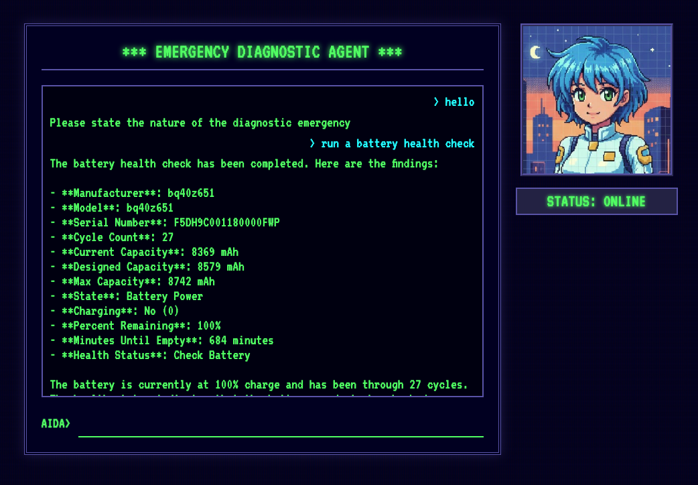

# AIDA - AI Diagnostic Agent

AIDA is a local, privacy-focused emergency diagnostic agent. It leverages `osquery` to inspect system state and uses a sophisticated local RAG (Retrieval-Augmented Generation) system to understand osquery's extensive schema and utilize expert-written query packs.



## Key Features

*   **100% Local & Private**: Runs entirely on your machine using local LLMs (via Ollama) and on-device embedding models.
*   **Osquery Expert**: Grounded in the official osquery schema and standard query packs.
*   **Persistent RAG Engine**: High-performance, low-latency vector search using a persistent in-memory embedding model (Gemma-300M).
*   **Query Library**: Instantly recalls hundreds of expert queries for complex tasks like malware hunting, filtered by your operating system.
*   **Schema Discovery**: Can find and understand any of the 280+ osquery tables to construct custom queries on the fly.

## Architecture

*   **Agent Framework**: Built with `google.adk`.
*   **LLM**: **Qwen 2.5** (via Ollama) for reasoning and tool use.
*   **RAG System**: Pure SQLite implementation using `sqlite-vec` (vector search) and `sqlite-ai` (in-database embeddings).
*   **Interface**: FastAPI backend serving a retro-styled HTML/JS frontend.

## Prerequisites

*   Python 3.12+
*   `git`
*   **Ollama** running locally (`ollama serve`).
*   `osquery` installed on the host system.

## Quick Start

1.  **Setup**: Run the automated setup script to install dependencies, fetch osquery data, download models, and build the knowledge base.
    ```bash
    ./setup.sh
    ```
    *(This may take a few minutes as it downloads a ~300MB embedding model and ingests data.)*

2.  **Run**: Start the agent server.
    ```bash
    uvicorn main:app --reload
    ```

3.  **Interact**: Open `http://127.0.0.1:8000` in your browser.

## Development

*   **Tests**: Run the integration test suite.
    ```bash
    python3 test_aida_core.py
    ```
*   **Linting**: Keep the code clean.
    ```bash
    ruff check . --fix && ruff format .
    ```

## Project Structure

*   `aida/agent.py`: Core agent definition, persona, and tools.
*   `aida/osquery_rag.py`: Persistent RAG engine for schema discovery.
*   `aida/query_library.py`: Vector search tool for pre-defined query packs.
*   `ingest_osquery.py`: Ingests `.table` schema definitions into `osquery.db`.
*   `ingest_packs.py`: Ingests standard `.conf` query packs into `osquery.db`.
*   `main.py`: FastAPI application and web UI.